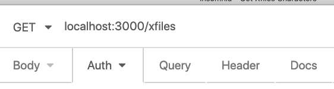

# Authentication and Authorization

To ensure that you don't have unwanted people accessing your services, you'll want to add some security around your application to make sure that the people accessing it are actually allowed to. We can do this through authentication and authorization. There are many different ways of going about authentication and authorization, bur first let's establish the difference: 

**Authentication: ** Determining whether the user is who they say they are. 

**Authorization: ** Determining whether or not a user is authorized to execute a certain command. 

The differences are relatively subtle, but think authentication of being the doorman at a bar, and authorization being a bartender who makes sure you're 21 before serving you any alcohol. 


### Authorization

The wording can get relatively confusing, but a common method of authentication comes in the form of sending `Authorization` headers. There are a number of ways to send auth headers, but typically speaking it looks like: 

```
Authorization: "METHOD" "KEY"
```

Where method is a specific type of authentication scheme (i.e. `Basic`, `Bearer`, `Digest`, `HOBA`, `Mutual`, `AWS4-HMAC-SHA256`), and `key` is an associated key to that method. 

Starting with the `basic` method, ultimately we're just encoding a `username:password` to base64. You could do this all by hand if you felt the desire, but ultimately, you can just use Insomnia or Postman's Authentication tab to include a `Basic Auth`. This will do the encoding for us! 


### Basic Auth: 

When you choose `Basic Auth`  as an auth method, you need to supply both a username and a password, which will ultimately get added to the header! Let's write a quick middleware to visualize what's going on and add `basicAuth.js` to our `/lib/middleware` directory: 

```
.
├── index.js
├── lib
│   ├── middleware
│   │   ├── basicAuth.js
│   │   ├── bodyParser.js
│   │   ├── logger.js
│   └── swagger.js
├── models
│   └── xfilesCharacter.js
├── package-lock.json
├── package.json
├── routes
    ├── office
    │   ├── office.js
    │   └── officeRoute.js
    ├── parksAndRec
    │   ├── parksAndRecRoute.js
    │   └── parksNRec.js
    └── xfiles
        └── xfilesRoute.js
```

`basicAuth.js`: 

```javascript
const basicAuth = async (req, res, next) => {
  // if someone doesn't supply an authorization header, 
  // we want to make sure it's at least a string instead of undefined
  const requestHeader = req.headers.authorization || "";
  console.log("Auth Header ", requestHeader);
  
  // split the request header on a string and look at data:
  const [type, payload] = requestHeader.split(" ");
  console.log("Types: ", type);
  console.log("Payload: ", payload);  // This payload looks weird.
	 
  next()
};

module.exports = basicAuth;

```

In the above code, there's a lot happening. First and foremost, at line 4, we're extracting the request header (and short circuiting so that if `req.headers.authorization` returns undefined, we can at least get a string back), and from there, we're pulling out both type and payload from the split.  

Let's add this to our middleware to our `index.js` and see what happens: 

```javascript
const express = require("express");
const officeRouter = require("./routes/office/officeRoute");
const parksAndRecRouter = require("./routes/parksAndRec/parksAndRecRoute");
const xfilesRouter = require("./routes/xfiles/xfilesRoute");

const logger = require("./lib/middleware/logger");
const app = express();
const swaggerUI = require("swagger-ui-express");
const swaggerDoc = require("./lib/swagger");
const basicAuth = require("./lib/middleware/basicAuth");

const mongoose = require("mongoose")
const mongoURL = "mongodb://127.0.0.1:27017/xfiles";
mongoose.connect(mongoURL, {
  useNewUrlParser: true,
  useUnifiedTopology: true
})
const dbConnection = mongoose.connection
dbConnection.on('error', err => console.error(err))
dbConnection.once('open', () => console.log("Connected to db"))


app.use(logger);
app.use("/api-docs", swaggerUI.serve, swaggerUI.setup(swaggerDoc));
app.use("/office", officeRouter);
app.use("/parksAndRec", parksAndRecRouter);

app.use(basicAuth);
app.use("/xfiles", xfilesRouter);


const port = 3000;
app.listen(port, () => console.log("Now listening on port:", port ));
console.log(`Swagger docs at localhost:${port}/api-docs`);

```

Notice that we placed `app.use(basicAuth);` right above `app.use("/xfiles", xfilesRouter);`. This will mean that we only require a username and password for any attempts to hit the `/xfiles` route! 


##### Grabbing the Username and Password

When hitting the `/xfiles` route, we'll need to supply a username and password. To do that, click on the drop down menu of `Auth`: 



Click the dropdown for `Auth`, and select `Basic Auth`: 


Finally, when making the call, be sure to enter a username and password: 


When we call our function via insomnia, we wind up printing: 

```
Auth Header  Basic c29tZXVzZXI6c29tZXBhc3N3b3Jk
Types:  Basic
Payload:  c29tZXVzZXI6c29tZXBhc3N3b3Jk
```

So, what's happening above is that we're sending a username and a password, but they're being encoded to non-plain-text. So, in order to work with this, we'll need to figure out a way to decode the data in `basicAuth.js`: 

```javascript
const { confirmUser } = require("../../routes/users/userServices");

const basicAuth = async (req, res, next) => {
  const requestHeader = req.headers.authorization || "";
  console.log("Auth Header ", requestHeader);

  const [type, payload] = requestHeader.split(" ");

  console.log("Types: ", type);
  console.log("Payload: ", payload);
  if (type === "Basic") {
    const credentials = Buffer.from(payload, "base64").toString("ASCII");
    console.log("Credentials: ", credentials);

    const [username, password] = credentials.split(":");
    console.log("username: ", username);
    console.log("password", password);

    if (username === 'coolguy' && password === 'password!') next();
    else
      res.send({
        status: 401,
        message: "You're not authorized to see the x-files",
      });
  }
};

module.exports = basicAuth;

```

Now, when we run this code, we get: 

```
Types:  Basic
Payload:  c29tZXVzZXI6c29tZXBhc3N3b3Jk
Credentials:  someuser:somepassword
```

What's happening is that we're decoding the payload from Base64 to ascii! We're then printing the credentials (i.e. the decoded auth payload), and we get a `username:password` string! So, naturally, we need to break that up with a string split to get a readable  username and a password (where someuser is the username and somepassword is the password). 


##### Adding a New User and Password

As of now, we're just hard coding a username and password check. If our user has a username of `coolguy` and a password of `password`, then we can move on to our endpoint (by calling `next()`), otherwise, we respond with a `401 unauthorized`. 

Even though we're authorizing against hard coded data, this is the general strategy we want to employ to see if a user should get access to our side via username and password. 

Let's make things more dynamic by creating a route to add users. First, we'll need to add a new model for our database `./models/user.js`, and then a new route for adding a user `./routes/users/userServices.js`:

```
.
├── index.js
├── lib
│   ├── middleware
│   │   ├── basicAuth.js
│   │   ├── bodyParser.js
│   │   ├── logger.js
│   └── swagger.js
├── models
│   ├── user.js
│   └── xfilesCharacter.js
├── package-lock.json
├── package.json
├── routes
    ├── office
    │   ├── office.js
    │   └── officeRoute.js
    ├── parksAndRec
    │   ├── parksAndRecRoute.js
    │   └── parksNRec.js
    ├── users
    │   └── userServices.js
    └── xfiles
        └── xfilesRoute.js
```

`models/user.js`

```javascript
const mongoose = require('mongoose')

const userPassSchema = new mongoose.Schema({
  username: {
    type: String, 
    required: true,
    unique: true,     
  }, 
  password: {
    type: String, 
    required: true
  }
})

module.exports = mongoose.model("usertable", userPassSchema)
```

`userServices.js`

```javascript
const express = require("express");
const bodyParser = require("../../lib/middleware/bodyParser");
const bcrypt = require("bcrypt");
const userModel = require('../../models/user')

const addUser = async (req, res) => {
  try {
    const { username, password } = req.body;

    const user = new userModel({
      username,
      password,
    });
    const result = await user.save();

    res.send(result);
  } catch (error) {

    console.error(error);
    res.status(500);
    res.send(error);
  }
};

const userRouter = express.Router();

userRouter.route("/").post(bodyParser.json(), addUser);

module.exports = { userRouter };

```

`index.js`

```javascript
const express = require("express");
const officeRouter = require("./routes/office/officeRoute");
const parksAndRecRouter = require("./routes/parksAndRec/parksAndRecRoute");
const xfilesRouter = require("./routes/xfiles/xfilesRoute");
const { userRouter } = require("./routes/users/userServices");

const logger = require("./lib/middleware/logger");
const app = express();
const swaggerUI = require("swagger-ui-express");
const swaggerDoc = require("./lib/swagger");
const basicAuth = require("./lib/middleware/basicAuth");

const mongoose = require("mongoose")
const mongoURL = "mongodb://127.0.0.1:27017/xfiles";
mongoose.connect(mongoURL, {
  useNewUrlParser: true,
  useUnifiedTopology: true
})
const dbConnection = mongoose.connection
dbConnection.on('error', err => console.error(err))
dbConnection.once('open', () => console.log("Connected to db"))


app.use(logger);
app.use("/api-docs", swaggerUI.serve, swaggerUI.setup(swaggerDoc));
app.use("/office", officeRouter);
app.use("/parksAndRec", parksAndRecRouter);
app.use("/newUser", userRouter);

app.use(basicAuth);
app.use("/xfiles", xfilesRouter);


const port = 3000;
app.listen(port, () => console.log("Now listening on port:", port ));
console.log(`Swagger docs at localhost:${port}/api-docs`);

```

In the above code, we've added an `add` method for our `newUser` route. This route allows for us to add a user to our database! This method pulls a username and password from a post body and adds them to our database. You may be wondering why we're exporting the module inside of an object. That'll make more sense later! For now, just don't forget to destructure it when you import it! 

Remember that we're connecting to our `xfiles` database (the final slash of the `mongoURL` ) and we're connecting to the collection of `usertable` to store our usernames and passwords. Let's create a username now: 


##### Check for a User's Password

Now that we've added a user, we're going to need a way to check username and password against the database. To do so, we'll need another method! So far, we've got a single method that only adds folks to the database. We'll need another to grab them out. For the time being, we'll keep using the `userServices.js` file for our database functions, but we will eventually want to move most of our functions out of our routes folders, but for now, let's keep moving forward by adding a method to our `userServices.js`

```javascript
... 

const confirmUser = async (username, password) => {
  try {
    const results = await userModel.findOne({
      username,
    })

    console.log("results? ", results)
    if (results && password === results.password) {
      return true;
    }

    return false;
  } catch (error) {

    throw new Error("Internal server error");
  }
};

...

const userRouter = express.Router();

userRouter.route("/").post(bodyParser.json(), addUser);

module.exports = { userRouter, confirmUser };

```

First and foremost, in confirm user, we've created a function that calls our mongo database, finds a user with the same username, and then check their password to ensure that they're the same. If our user is who they say they are, then we return true, otherwise we return false! 

Now, let's change our middleware `basicAuth.js` to actually check to see whether users exist: 

```javascript
const { confirmUser } = require("../../routes/users/userServices");

const basicAuth = async (req, res, next) => {
  const requestHeader = req.headers.authorization || "";
  console.log("Auth Header ", requestHeader);

  const [type, payload] = requestHeader.split(" ");

  console.log("Types: ", type);
  console.log("Payload: ", payload);
  if (type === "Basic") {
    const credentials = Buffer.from(payload, "base64").toString("ASCII");
    console.log("Credentials: ", credentials);

    const [username, password] = credentials.split(":");
    console.log("username: ", username);
    console.log("password");

    const isAuthenticated = await confirmUser(username, password);
    console.log("is authenticated?", isAuthenticated);
    if (isAuthenticated) next();
    else
      res.send({
        status: 401,
        message: "You're not authorized to see the x-files",
      });
  }
};

module.exports = basicAuth;

```

So now we're confirming our username and password against our database. Before we move on, however, we'll need to update our `index.js` (since we're now returning multiple functions from `userServices.js`): 


##### Encrypting User's Stored Password

We're storing our username and password in our database, however, we're storing this data plaintext. While it may be unlikely that someone comes and steals our data, storing username and password information in plaintext is not advisable. Let's update our code to encrypt our passwords. To do this, we'll want to use the package [bcrypt](https://github.com/kelektiv/node.bcrypt.js#readme).  

First, install bcrypt: 

```bash
npm i bcrypt
```

Next, we'll want to change the way we're adding passwords to the database. We'll need to encrypt them, and we'll want to make sure that we can decrypt these passwords in our databases to check against those that we bring in from our authorization middleware via the `confirmUser` function in our `userServices.js` file: : 

```javascript
... 

const bcrypt = require("bcrypt");

...


const confirmUser = async (username, password) => {
  try {
    const results = await userModel.findOne({
      username,
    })

    console.log("results? ", results)
    if (results && (await bcrypt.compare(password, results.password))) {
      return true;
    }

    return false;
  } catch (error) {

    throw new Error("Internal server error");
  }
};

const addUser = async (req, res) => {
  try {
    const { username, password } = req.body;
    const hashedPassword = await bcrypt.hash(password, 10);

    const user = new userModel({
      username,
      password: hashedPassword,
    });
    const result = await user.save();

    res.send(result);
  } catch (error) {

    console.error(error);
    res.status(500);
    res.send(error);
  }
};


...
```


Now that we're able to both save encrypted data and retrieve it from our database, and decrypt it to check authorization, let's see what these data look like saved in our database after we create a new user `newperson`: 


Upon querying the database, we get: 

```
> db.userpasses.find({ username: 'newperson' })
{ "_id" : ObjectId("5e995f0efb3175490a123682"), "username" : "newperson", "password" : "$2b$10$YGBdfPD1DXe3679/3O3tGuD0TFfxL1TRHJvc82OV9RzV4PFx9JnZG", "__v" : 0 }
```


### Bearer Tokens: 

You might be wondering why you have to send a username and password with ever single request, and you'd be right! Typically speaking, once you log into a site, you don't have to constantly require your username and password to prove who you are. How does this work? This is done through authentication! Once you authorize yourself, you need only to provide a token, and then you'll be set! Granted, right now we don't have anything for authentication, so let's get started: 


##### Basics of a Token

All a token is, ultimately, is a special "key" that opens a door to your API. First you need get authorized via a username and password, and then, once a token is sent back, you can use that to authenticate your queries (and not send your username and password ever time). We already have a way for our users to log in (or at least be confirmed against their credentials), let's create an endpoint in our routes directory called `token.js` and save it next to userServices. The point of this code will be  for a user to supply their name and password, and then respond with a brand new created token: 

`token.js`

```javascript
const express = require("express");
const bodyParser = require("../../lib/middleware/bodyParser");
const { confirmUser } = require("./userServices");
const jsonWebToken = require("jsonwebtoken");

const createToken = (userId) => {
	return `${userId}_token`
};

const createTokenRoute = async (req, res) => {
  const { username, password } = req.body;

  const userExists = await confirmUser(username, password);

  console.log("user exists", userExists);

  if (userExists) {
    const token = createToken(username);

    console.log("token?", token);
    res.status(201);
    res.send(token);
  } else {
    res.send(422);
  }
};

const tokenRouter = express.Router();

tokenRouter.post("/", bodyParser.json(), createTokenRoute);

module.exports = tokenRouter;

```

`index.js`

```javascript
const express = require("express");
const officeRouter = require("./routes/office/officeRoute");
const parksAndRecRouter = require("./routes/parksAndRec/parksAndRecRoute");
const xfilesRouter = require("./routes/xfiles/xfilesRoute");
const { userRouter } = require("./routes/users/userServices");
const tokenRouter = require("./routes/users/tokens");

const logger = require("./lib/middleware/logger");
const app = express();
const swaggerUI = require("swagger-ui-express");
const swaggerDoc = require("./lib/swagger");
const basicAuth = require("./lib/middleware/basicAuth");

const mongoose = require("mongoose")
const mongoURL = "mongodb://127.0.0.1:27017/xfiles";
mongoose.connect(mongoURL, {
  useNewUrlParser: true,
  useUnifiedTopology: true
})
const dbConnection = mongoose.connection
dbConnection.on('error', err => console.error(err))
dbConnection.once('open', () => console.log("Connected to db"))


app.use(logger);
app.use("/api-docs", swaggerUI.serve, swaggerUI.setup(swaggerDoc));
app.use("/office", officeRouter);
app.use("/parksAndRec", parksAndRecRouter);
app.use("/newUser", userRouter);
app.use("/tokens", tokenRouter);

app.use(basicAuth);
app.use("/xfiles", xfilesRouter);


const port = 3000;
app.listen(port, () => console.log("Now listening on port:", port ));
console.log(`Swagger docs at localhost:${port}/api-docs`);

```


First and foremost, what's happening in this file is that we have an endpoint called CreateTokenRoute that we're passing to the token router. When a user calls this endpoint, we extract the username and password from the request body, and then user our `confirmUser` function to see whether or not that user actually exists. If they do, great! Let's try it out (if you haven't already added `/tokens` to your route in your index make sure to do it now)! 


We're verifying our username and passwords, and then sending back a token created with the `createToken` function, which takes in a username, and returns a special "token" for us. Now whenever we want to authenticate, we can just include that token in our headers to verify on in our new `tokenAuth.js` file in our `middleware` directory. We'll extract the token, grab the username, and see if they exist in our database: 

`tokenAuth.js`

```javascript
const { confirmUserExists } = require("../../routes/users/userServices");


const tokenAuth = async (req, res, next) => {
  const header = req.headers.authorization;

  console.log("Headers are:", header);
  const [type, token] = header.split(" ");

  if (type === "Bearer") {
    const payload = token.split('_')
    console.log("Payload from tokenSign", payload);
    
    const userExists = await confirmUserExists(payload[0])
    if(userExists) next()
    else res.send(401)
  }
};

module.exports = tokenAuth;

```

`userServices.js`

```javascript
...


const confirmUserExists = async (username) => {
  try {
    const results = await userModel.findOne({
      username,
    })

    console.log("Results? ", results)
    if (results && results.username === username) {
      return true;
    }

    return false;
  } catch (error) {
    throw new Error("Internal server error");
  }
};


...

module.exports = { userRouter, confirmUser, confirmUserExists };
```

So, now we've got a token authentication middleware that extracts a username from the header, and checks to see whether or not that user exists in our database (via the `confirmUserExists` function). 

The one final step we need to make this work is to update our `index.js` with our token auth middleware: 

`index.js`

```javascript
const express = require("express");
const officeRouter = require("./routes/office/officeRoute");
const parksAndRecRouter = require("./routes/parksAndRec/parksAndRecRoute");
const xfilesRouter = require("./routes/xfiles/xfilesRoute");
const { userRouter } = require("./routes/users/userServices");
const tokenRouter = require("./routes/users/tokens");

const logger = require("./lib/middleware/logger");
const app = express();
const swaggerUI = require("swagger-ui-express");
const swaggerDoc = require("./lib/swagger");
const tokenAuth = require("./lib/middleware/tokenAuth");

const mongoose = require("mongoose")
const mongoURL = "mongodb://127.0.0.1:27017/xfiles";
mongoose.connect(mongoURL, {
  useNewUrlParser: true,
  useUnifiedTopology: true
})
const dbConnection = mongoose.connection
dbConnection.on('error', err => console.error(err))
dbConnection.once('open', () => console.log("Connected to db"))


app.use(logger);
app.use("/api-docs", swaggerUI.serve, swaggerUI.setup(swaggerDoc));
app.use("/office", officeRouter);
app.use("/parksAndRec", parksAndRecRouter);
app.use("/newUser", userRouter);
app.use("/tokens", tokenRouter);

app.use(tokenAuth);
app.use("/xfiles", xfilesRouter);


const port = 3000;
app.listen(port, () => console.log("Now listening on port:", port ));
console.log(`Swagger docs at localhost:${port}/api-docs`);

```

Now that we've got our token auth set up and working as a middleware, let's try it out! To send an auth token, it's a lot like basic auth, but instead of sending a username and password in the header, we'll need to change our auth headers from `basic auth` to `bearer token`, and then pass the token we received as that "token": 


Clicking send, our token gets sent, and our middleware parses it, finds our user, and then authenticates! If we had a bad token, we'd receive: 


This is a fine token authentication service we have here, but if anyone remotely guesses someone else's username, then we're SOL! There has to be a better way! 


**Creating an Actual Token with JSON Web Token**

Originally, we were just responding with a string that said `<username>_token` to act as our token. While that is helpful, that's not a very strong token. In order to create a new, more secure token, we'll want to use `jsonwebtoken`, a [library for creating tokens](https://www.npmjs.com/package/jsonwebtoken)! Just like every other node module, we need to install it: 

`npm i jsonwebtoken`

Now that we have the json web token package, let's update our code to actually create real tokens that are significantly harder to break! 

`token.js`

```javascript
const express = require("express");
const bodyParser = require("../../lib/middleware/bodyParser");
const { confirmUser } = require("./userServices");
const jsonWebToken = require("jsonwebtoken");

const tokenSignature = "xfiles_is_bestfiles";

const createToken = (userId) => {
  return jsonWebToken.sign(
    {
      userId,
    },
    tokenSignature,
    { expiresIn: "5m" }
  );
};

const createTokenRoute = async (req, res) => {
  const { username, password } = req.body;

  const userExists = await confirmUser(username, password);

  console.log("user exists", userExists);

  if (userExists) {
    const token = createToken(username);

    console.log("token?", token);
    res.status(201);
    res.send(token);
  } else {
    res.send(422);
  }
};

const tokenRouter = express.Router();

tokenRouter.post("/", bodyParser.json(), createTokenRoute);

module.exports = tokenRouter;

```


In this above code, we've changed our `createToken` to actually use `jsonwebtoken.sign`. This method takes 3 arguments, the first is something we'd like to encode into our token, so let's use the username. The second argument is a signature. Ultimately when we encode this with that signature, the only way you could decode the data, is by using that exact same string. If you have it even slightly off, you'll scrambled data back (so we need to make sure to take special care of that). Lastly the final parameter of the sign method takes an object where you can pass in an object with the `expiresIn` key to add a time limit to how long your token lasts! 


##### Checking for a User's Token

Now that we're generating real tokens, we can't just check to see if strings have a username in them. Let's update our token auth file to actually work with our token: 

`tokenAuth.js`

```javascript
const jsonwebtoken = require('jsonwebtoken');
const {
  confirmUserExists
} = require('../../routes/users/userServices');


const tokenSignature = 'xfiles_is_bestfiles';

const tokenAuth = async (req, res, next) => {
  const header = req.headers.authorization;

  const [type, token] = header.split(' ');

  if (type === 'Bearer') {
    try {
      const payload = jsonwebtoken.verify(token, tokenSignature);
      console.log('Payload from tokenSign', payload);
      const doesUserExist = await confirmUserExists(payload.userId);

      if (doesUserExist) {
        next();
      } else {
        res.sent(401);
      }
    } catch (error) {
      res.send(error.message);
    }
  }
};

module.exports = tokenAuth;

```

Note that at line 7 we had to bring in our token signature. It's not ideal to have these stored directly in our code. We should consider using the dotenv package to obscure that data (I leave that to you!). What we're doing above is decoding our `jsonwebtoken`, and then checking to see if that encoded userId exists! In all likelihood it does (given that if it reaches that point, the token has been properly decoded), but it's always good to check.


##### 


